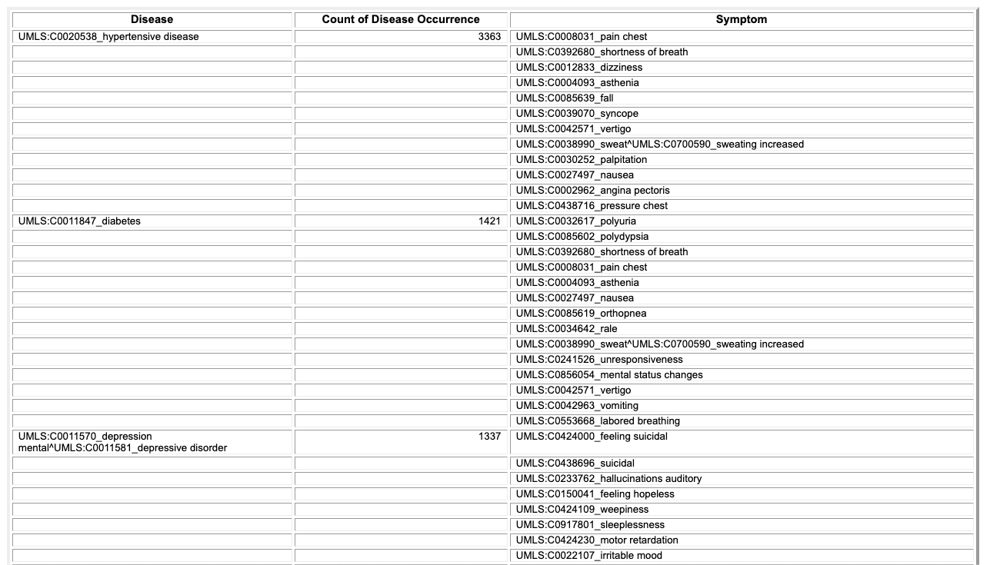

 

<h1 align="center">Disease Prediction from Symptoms</h1>

<h4>A data mining application to predict disease using symptom data i.e. <strong>Prognosis</strong>. To develop this application, we use the <strong>Columbia University dataset</strong> and build a model using both Multinomial Naive-Bayes and Decision Tree Algorithm to predict the disease given the symptoms observed in a person.</h4>

-----------------------------------------
### Columbia University Dataset
 
* This dataset is a knowledge database of disease-symptom associations generated by an automated method based on information in textual discharge summaries of patients at New York-Presbyterian Hospital admitted during 2004. The dataset can be found [here](http://people.dbmi.columbia.edu/~friedma/Projects/DiseaseSymptomKB/index.html).

* The first column shows the disease, the second the number of discharge summaries containing a positive and current mention of the disease, and the associated symptom. 

  

------------------------------------------
### Tasks performed

- `Data extraction and cleaning` :  Basic cleaning, segmentation of columns and string formatting were performed in Excel. 
- `Data preprocessing` : Data preprocessing tasks performed include:
  * Spelling mistakes in the names of diseases or symptoms or their codes was rectified
  * The codes which were given to diseases and symptoms were removed as they were irrelevant for our task
  * A cumulative list of all symptoms was made 
  * Each symptom was assigned a Boolean value of 0 or 1 for each disease, according to whether the symptom occurs with the disease or not
- `Data visuaization` : Built correlation heatmaps for relationship between the symptoms and relationship between the diseases
- `Model Building` : Used 2 algorithms for this dataset and compared the results to evaluate which one yielded better results: **Multinomial Naive Bayes Classifier** and **Decision Tree**

Find the detailed documentation [here](https://gdoc.pub/doc/e/2PACX-1vTJFBAdnpav3HpjfVGGb5LFeO-z_5rThL9oYMNxQqRU7WYUv5fVWxuewughcBu6ww9jfQIlVRDY3rRC).

------------------------------------------
### Results

The results of all the tasks can be viewed by running [this](https://colab.research.google.com/drive/1gS8L3QydlmP3DuNXhJkYdarOscCj7frF) code in Google Collab or in the detailed documentation above. 

The entire decision tree is too big to be inserted here, so only a part of it is shown here. The entire image can be found [here](https://drive.google.com/file/d/1bJ6ZD5ZDh0Cqs0R23DWBEHPYP6flxLx9/view?usp=sharing).

  

------------------------------------------
### Contributors

Mihir Gandhi - [mihir-m-gandhi](https://github.com/mihir-m-gandhi)

Jasdeep Singh Grover - [jasdeep100](https://github.com/jasdeep100)

Hardik Chodvadiya - [willyhardik](https://github.com/willyhardik)

Amit Dave - [amitdave1998](https://github.com/amitdave1998)

------------------------------------------
### License
This project is licensed under the MIT - see the [LICENSE](./LICENSE) file for details.
